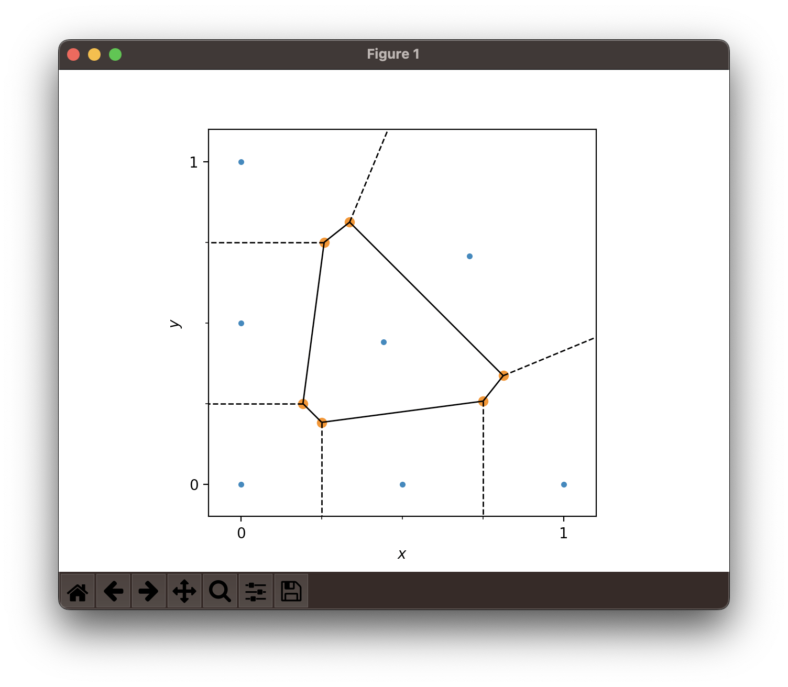

# Voronoi diagrams

* H Paul Keeler [post](https://hpaulkeeler.com/voronoi-dirichlet-tessellations/)
* Animation of Voronoi growth in [MATLAB](https://commons.wikimedia.org/wiki/File:Voronoi_growth_euclidean.gif)
* Additional [animations](https://commons.wikimedia.org/wiki/User:Jahobr/Voronoi)
* Historical dualization from Voronoi on [SIBL](https://github.com/sandialabs/sibl/blob/master/geo/doc/plot_voronoi.py)
  * 
* Scipy spatial [voronoi](https://docs.scipy.org/doc/scipy/reference/generated/scipy.spatial.Voronoi.html)